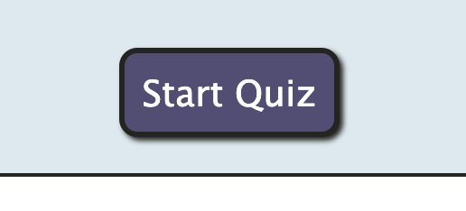
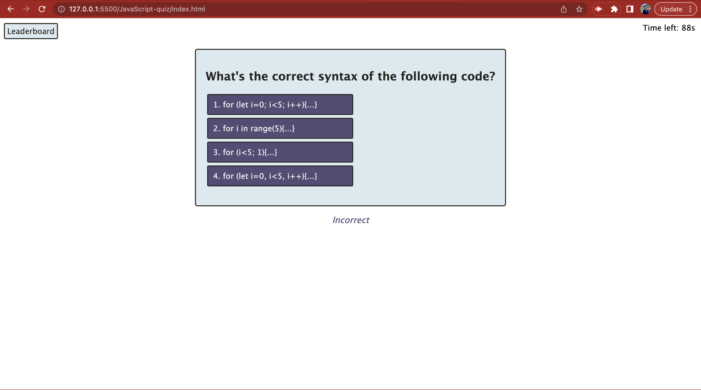
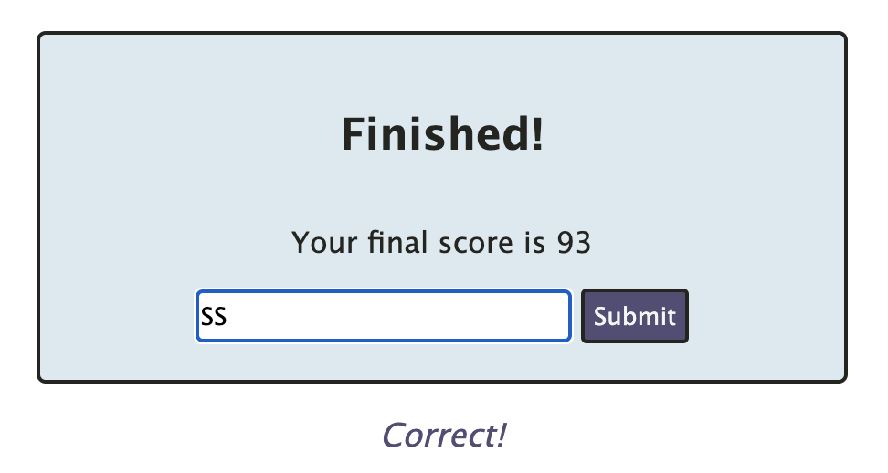
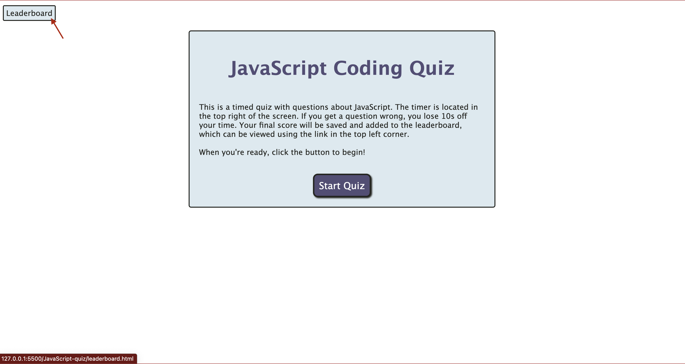
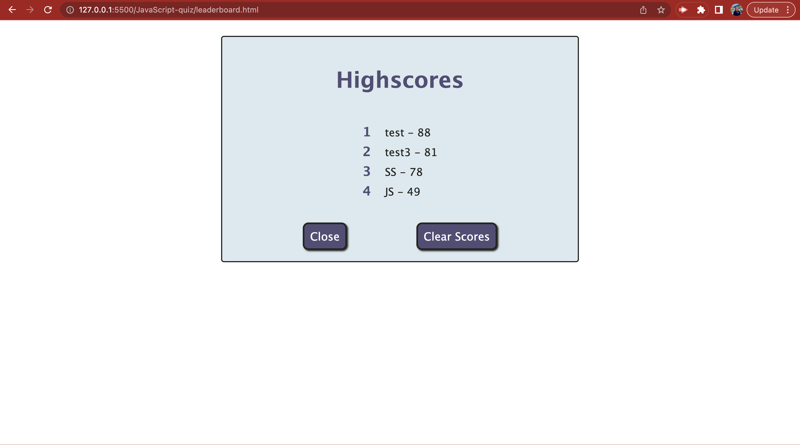

# JavaScript Quiz

## Description

This is a timed quiz all about JavaScript. 

A series of questions stored in an object are displayed on screen after the user clicks the "Start Quiz" button using event listeners for the start button and the quiz container and a counter to keep track of the questions. A timer starts counting down from 100 seconds; when an answer is selected, the target's value is compared to the question's correct answer - if they don't match, the timer decreases by 10 seconds. After all questions are answered, or the timer reaches 0, the quiz ends, the final score is displayed, and the user is prompted to submit their initials and their score to the leaderboard. The inputed initials and score are sorted by highest score value and then saved to local storage as a JSON string.

The leaderboard is a separate HTML page that can be accesed by a link in the top left of the navigation bar. On this page, the saved scores are retrieved from local storage and displayed from highest to lowest. Here, the user can navigate back to the main page with the quiz, or clear the highscores. The "Clear Scores" button sets the inner HTML of the list and the local storage key value to nothing.

During this project, I learned how to connect multiple HTML and JavaScript files to use in tandem. I also increased my understanding of event listeners and accessing HTML elements, values, and text contents in JavaScript.

## Table of Contents

- [Installation](#installation)
- [Usage](#usage)
- [Credits](#credits)
- [License](#license)

## Installation

N/A

## Usage

This project is a quiz about JavaScript that stores and displays scores in order. You can use this website to test your JavaScript knowledge, challenge your friends, and view the highscores.

Start the quiz and timer by clicking the "Start Quiz" button.

Once the quiz begins, you have 100 seconds to answer all 5 questions. Each question has 4 clickable options, but only 1 right answer. If you answer a question incorrectly, you will receive an "Incorrect" message below the quiz and 10 seconds will be deducted from your time.

After all 5 questions are answered or the timer reaches 0, the quiz will end and you will be promtped to enter your initials to save your highscore. Enter your initials in the box and click the "Submit" button to save.

You can view the highscores using the "Leaderboard" link in the top left corner.

Here you will see a list of the saved scores in order from highest to lowest. You can use the "Close" button to exit the leaderboard and go back to the quiz, or you can click the "Clear Scores" button to wipe the highscores.

You can access the entire website here: https://stms15.github.io/JavaScript-quiz/. 

## Credits

This <a href="https://stackoverflow.com/questions/40133582/assign-value-not-reference-in-javascript#:~:text=How%20can%20I%20assign%20the,an%20object%20to%20another%20object%3F&text=at%2014%3A02-,How%20can%20I%20assign%20the%20value%20not%20the%20reference%20of,the%20object%20as%20%40tymeJV%20says." target="_blank">Stack Overflow thread</a> was referenced to fix a variable assignment issue. The variable was being assigned the location reference of an object from another variable instead of the value of the object. This was fixed by converting the object value to a JSON string and then parsing it.

Another <a href="https://stackoverflow.com/questions/1129216/sort-array-of-objects-by-string-property-value" target="_blank">Stack Overflow thread</a> was used to understand how to sort a list of objects by one particular property value. This was applied to the list of highscores found in the <code>submitBttnEl</code> event listener, which uses the <code>CompareScores()</code> function to sort.

To learn how to create a numbered list with coloured elements for the "leaderboard.html" page, <a href="https://www.w3.org/Style/Examples/007/color-bullets.en.html">this website</a> was referenced.

## License

This project has a MIT license. Please refer to the LICENSE file for more details.

---

## Badges

